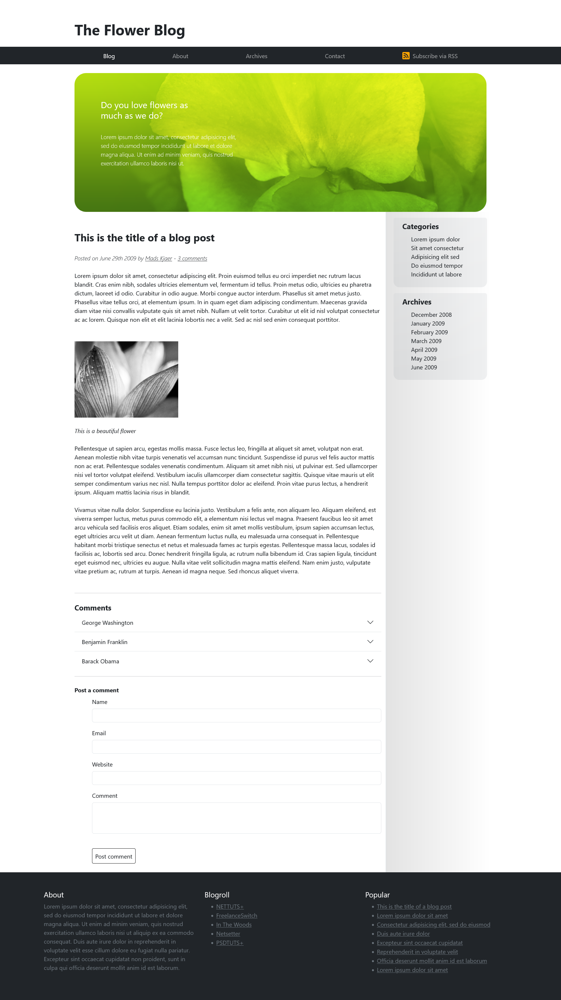

# 🌸 Flower Blog

Flower Blog is a simple and elegant blog website built with **HTML** and **Bootstrap**. It’s perfect for sharing articles, tips, or stories about flowers and gardening.

## 🌟 Features

- Responsive design using Bootstrap
- Clean and beautiful layout
- Mobile-friendly and easy to customize
- Lightweight and fast

## 📁 Technologies Used

- HTML5
- Bootstrap 5
- CSS3 (optional for extra styling)

## App Screenshot

 >

## 🚀 How to Use

1. Clone the repo:

   ```bash
   git clone https://github.com/mahmoud1mandour/the-flower-blog.git
   ```

2. Open the index.html file in your browser.
